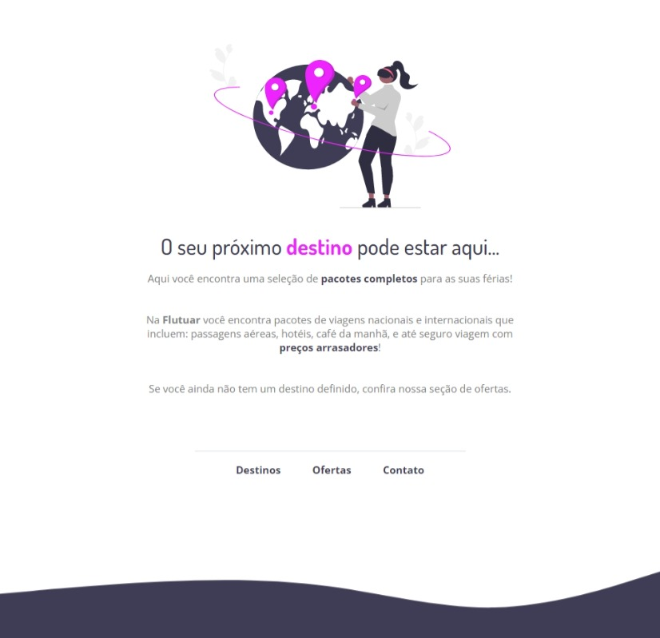

  

## Projeto </>

Neste projeto tive que reacriar esta aplicação Web do mesmo jeito que está no projeto do Figma.

Neste projeto pude fortalecer alguns conceitos como:

- Estruturando um projeto HTML;
- Uso de tags HTML mais comuns;
- Conceitos iniciais de CSS;
- Posicionamento e alinhamento de elementos na tela;
- Aplicando fontes customizadas;
- Espaçamentos.

## Tecnologias utilizadas </>

- HTML
- CSS
- Figma
- Git e Github

## Layout </>

Você pode visualizar o layout do projeto através
[desse link](https://www.figma.com/file/kuBRhOlzLgpM2k3mq1RDu7/Projeto01-Extra-(Copy)?type=design&node-id=0%3A1&t=7dJXfgZGNwf8Zsda-1).
É necessário uma conta [Figma](https://www.figma.com)